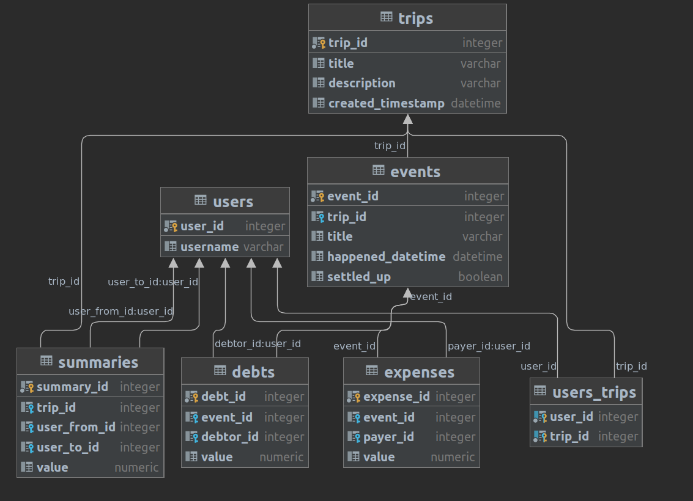

## Split vise 

`orm` `database` `sqlalchemy`

### Легенда 

В совместных поездках большими и не очень компаниями удобно, когда один человек платит от лица всей компании (ресторан, такси, etc).   
Тут возникает проблема отслеживания кто, сколько и кому должен по итогу поездки. Предлагаем вам сделать простенькое приложение для этих целей

### Задача 

Вам нужно написать мини-библиотечку для разделения оплаты. В готовом шаблоне нужно дописать базу данных и функции взаимодействия с ней. 

#### База данных

В качестве базы данных мы будем использовать `sqlite`, которая не подойдет для большинства "продакшн" задач, но нам для тестовых целей - вполне.  
Для взаимодействия с ней будет использован самый популярный `orm` для питона на текущий момент: `sqlalchemy` (`2.0-style`; версия `1.4/2.0`)

Итоговая схема базы данных может выглядеть так: 
 

Пара слов о предлагаемой структуре:
- `trips` - таблица поездок. Отображает сущность, в рамках которой постепенно копится информация о произведенных расчетах. Предполагается, что в конце поездки все расходы будут подсчитаны и каждому из участников поездки будет сказано сколько и кому нужно перевести денег, чтобы все были в расчете
- `events` - событие, в рамках которого происходили какие-то расчеты. События бывают разные: чаще всего те, в рамках которых один человек платит за всех, а остальные затем скидываются поровну, но также случается необходимость поделить чек не поровну, а с какими-то произвольными суммами; наконец, вдруг может получиться так, что оплату вносит не один человек, а несколько. Данная сущность объединяет вместе набор оплат и долгов для последующего просмотра истории
- `expenses` - привязывается к событию и содержит информацию о том кто и сколько заплатил за всех
- `debts` - также привязывается к событию и содержит информацию о том кто сколько должен по результатам события
- `summaries` - табличка итоговых расчетов. Предполагается что после окончания поездки она будет содержать информацию о том, кто сколько кому должен перевести

- Вы можете добавлять свои таблицы и колонки до тех пор, пока задача проходит тесты 

Вам дается файл `splitvise.models.base`, содержащий базовый код для начала работы с sqlalchemy, его содержимое также используется в тестах, так что настоятельно не рекомендуется его менять. В качестве примера за вас уже реализована модель таблички `users`. Также для упрощения жизни за вас написана часть модели для таблички `trips` вместе с отношением многие-ко-многим с табличкой пользователей. Модели других таблиц вам предстоит написать. Нет отдельного теста на структуру таблиц, однако в некоторых тестах могут встречаться SQL запросы к базе напрямую и почти везде захардкожены названия таблиц с рисунка - учтите это при проектировании структуры. При использовании структуры с картинки возможность сдать задание гарантируется написанным эталоном (а вот тесты слабые, так что если видите что проходит что-то с логической ошибкой - велкам мердж реквестить тесты)

#### Core

Основную логику вам нужно написать в `core`. Там содержатся функции, которые реализуют основную логику и инкапсулируют работу с базой данных 

Более подробное описание см в docstring'ах функций

### Полезные заметки 

Note: все совпадения с реальными приложениями и/или продуктами случайны  
Note2: vise - это не wise. vise - это платёжная система  

### Полезные ссылки 

* [Туториал sqlalchemy 1.4/2.0](https://docs.sqlalchemy.org/en/14/tutorial/index.html)